# 📌 Multi-Vendor E-commerce Marketplace

### ❓ **The Million-Dollar Question:**
**"How to handle millions of requests per second?"**

- To tackle this challenge, you need a scalable, responsive, and reliable system. This is exactly what I’ve built with the Multi-Vendor E-commerce Marketplace — a robust platform designed to connect buyers and sellers in a seamless, user-friendly ecosystem. The platform offers features like easy product discovery, efficient order management, secure payment processing, and multi-channel transaction support.

❗❗ Below is a high-level overview of the system architecture, focusing on the main components and their interactions. For more in-depth details about workflows, data constraints, and business logic, please refer to the code.

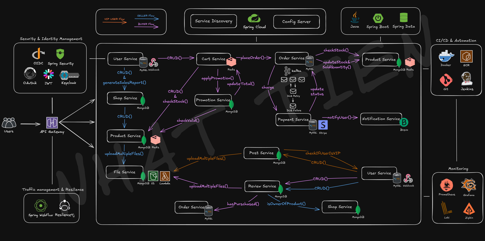

## 🏗 Architecture Overview

### Microservices Architecture

- **Service Segmentation**:  
  Each feature is encapsulated within its own service, promoting focus on specific domains. This modular approach enables easier updates, better maintainability, and independent deployments without disrupting the whole system.

- **Scalability**:  
  Services can be scaled independently based on demand. For example, if a service experiences high traffic, it can be scaled without affecting other services, ensuring efficient resource utilization and consistent performance.

- **Loose Coupling**:  
  Services communicate via APIs and messaging queues, ensuring minimal dependencies between components. This decoupling makes it easier to update, maintain, and scale individual services while reducing the risk of system-wide failures.

- **Resilience**:  
  Fault tolerance mechanisms such as retries and circuit breakers isolate failures, maintaining system availability even if one or more services face issues.

- **Independent Deployability**:  
  Since each service operates independently, new features and updates can be deployed without impacting other services, enabling faster development cycles and reducing downtime.

- **Cost Efficiency**:  
  The ability to scale services independently ensures that resources are allocated efficiently. Services under heavy load can be scaled up without requiring additional infrastructure for the entire system.
  
  

---

## 🛠 Technologies Used

### Java & Spring Framework

-  **Java:**  
  - The primary language for building scalable, high-performance microservices, ideal for handling high transaction volumes.

-  **Spring Framework:**  
  - **Spring Boot:**  
    Simplifies microservice development with minimal configuration, enabling quick setup and reducing boilerplate code so developers can focus on features.

  - **Spring Security:**  
    Provides robust authentication and authorization mechanisms across microservices. Supports Single Sign-On (SSO) and JSON Web Token (JWT) for secure and seamless communication between services and users.

  - **Spring Data:**  
    Simplifies data persistence with repositories, streamlining database operations such as retrieval, updates, and CRUD functionality, while reducing the need for verbose SQL queries.

  - **Spring Cloud:**  
    Enhances system scalability and flexibility by offering tools for service discovery, configuration management, and load balancing, ensuring smooth operation in distributed environments.
    
  - **Spring WebFlux:**  
    Facilitates asynchronous, non-blocking API development using reactive programming. It ensures responsiveness under high traffic by efficiently managing system resources, making it suitable for modern, event-driven architectures.
    
  - **Spring Kafka:**  
    Simplifies integration of Kafka messaging in Spring applications, supporting Kafka Producers/Consumers, Kafka Streams, and Kafka Connect for real-time data processing and system integration. It handles serialization, deserialization, and error management, enabling reliable event-driven architectures.

### Config Server & Service Discovery

- **Spring Cloud Config:**  
  Centralizes configuration management for microservices, allowing externalized properties to be shared and updated across services. This ensures consistent configurations across environments and simplifies service updates without downtime.

- **Eureka Server:**  
  Functions as a service registry for microservices, enabling them to dynamically discover each other. It simplifies the scaling process and enhances fault tolerance by ensuring services can automatically register and deregister themselves as they scale or fail, maintaining smooth inter-service communication. Eureka also integrates with client-side load balancing, ensuring traffic is evenly distributed across available service instances, improving performance and resilience.

  
  
### Service Communication

- **Feign Client**:
  
  Feign Client simplifies inter-service communication by automatically generating REST client proxies, eliminating the need for manually writing HTTP requests and handling responses. This reduces boilerplate code and increases developer efficiency.

-  **Kafka:**

  Kafka is a distributed messaging platform that enables asynchronous communication between microservices. It ensures reliable message storage and distribution, making it ideal for event-driven architectures. Kafka decouples services and improves scalability by allowing them to communicate without direct dependency on each other.

#### Offset Explorer:
  
  
  
#### Grafana Dashboard:
  
  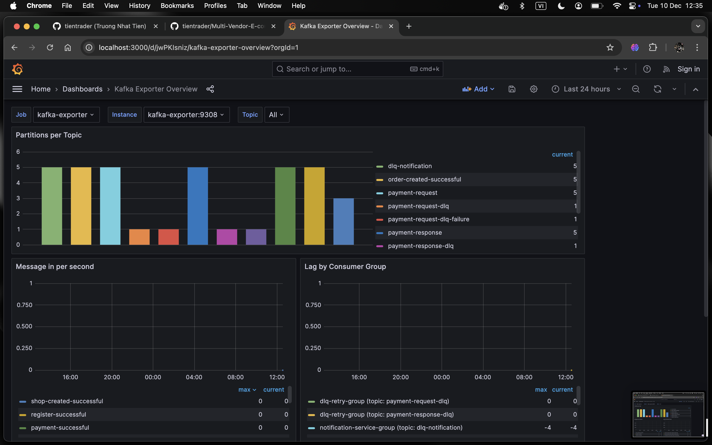
  
### Identity and Access Management

-  **Keycloak:**

  - **Single Sign-On (SSO):**  
    Allows users to log in once and access multiple services seamlessly. It uses industry standards like OAuth 2.0 and OpenID Connect to provide secure and reliable authentication.

  - **OAuth 2.0 & OpenID Connect:**  
    Implements secure and standardized authentication and authorization workflows. The Authorization Code Flow ensures safe token exchange between clients and the identity provider, improving system security.

  - **User Management:**  
    Provides a centralized system for managing user accounts, including registration, login, logout, profile updates, email verification, and password recovery/reset. This simplifies the user experience and ensures account security.

  - **Role-Based Access Control (RBAC):**  
    Manages permissions effectively by assigning roles to users. This ensures that only authorized users can perform specific actions or access sensitive resources.

  - **Multi-Factor Authentication (MFA):**  
    Enhances account security by requiring multiple factors for authentication. The platform verifies users' email addresses during registration to ensure account authenticity and supports Time-based One-Time Passwords (TOTP) through apps like Google Authenticator, adding an extra layer of protection.

  - **JSON Web Tokens (JWT):**  
    Utilizes RS256-signed JWTs for secure authentication and authorization. JWTs enable scalable, stateless user sessions across microservices while protecting against vulnerabilities like Cross-Site Request Forgery (CSRF).

  - **Social Login:**  
    Simplifies the authentication process by enabling users to log in with existing social accounts (e.g., Google, Facebook, GitHub). This feature reduces user friction and improves the onboarding experience.

  - **Argon2 Password Hashing:**  
    Ensures robust password security using the Argon2 algorithm, which is resistant to brute-force and hardware-based attacks due to its memory-hard design.

  - **SHA-256 for TOTP:**  
    Uses the SHA-256 hashing algorithm to generate secure Time-based One-Time Passwords (TOTP), ensuring the integrity and reliability of MFA codes.

  - **Password Recovery and Reset:**  
    Provides a secure and user-friendly process for recovering or resetting forgotten passwords. Strong validations ensure only authorized users can reset credentials, reducing unauthorized access risks.

  - **Customizable Flows:**  
    Administrators can tailor authentication and authorization workflows, such as adding conditions during first login, linking accounts with identity providers, or enforcing specific security policies.
 
#### Demo: Registration

#### Demo: Login (Username & Password)

#### Demo: Social Login

- Google

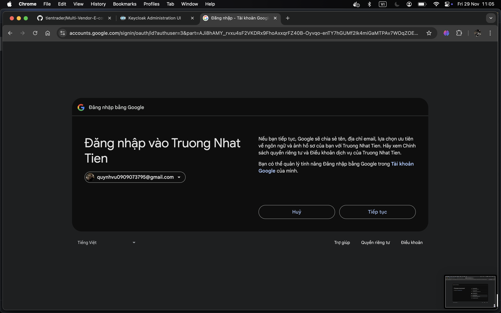

- Facebook

- Provide more information when the user chooses social login.

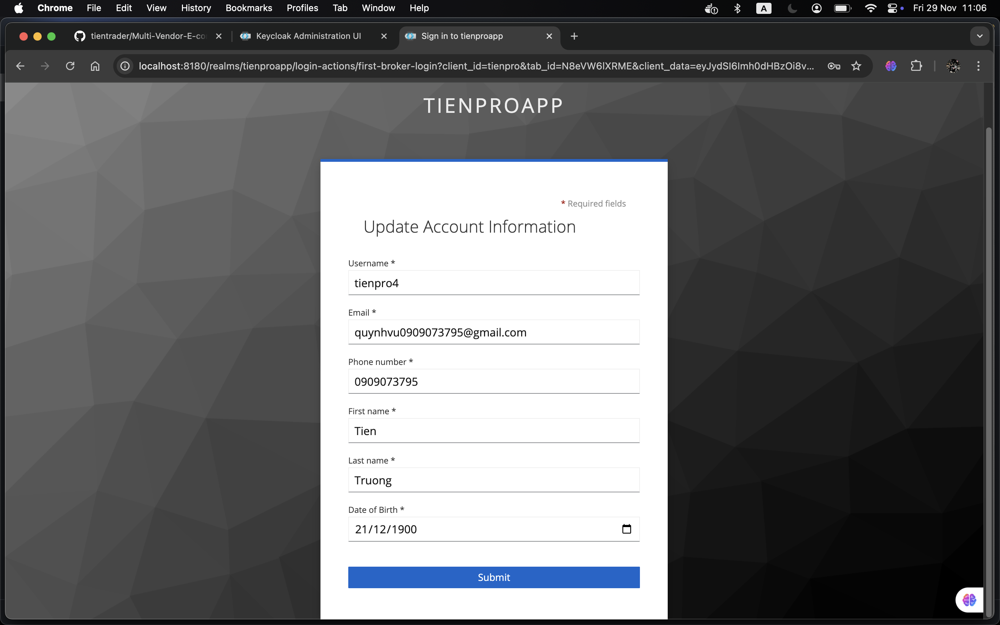

#### Demo: Forgot Password
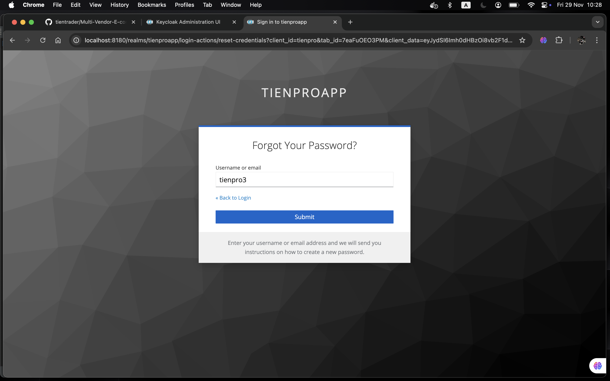
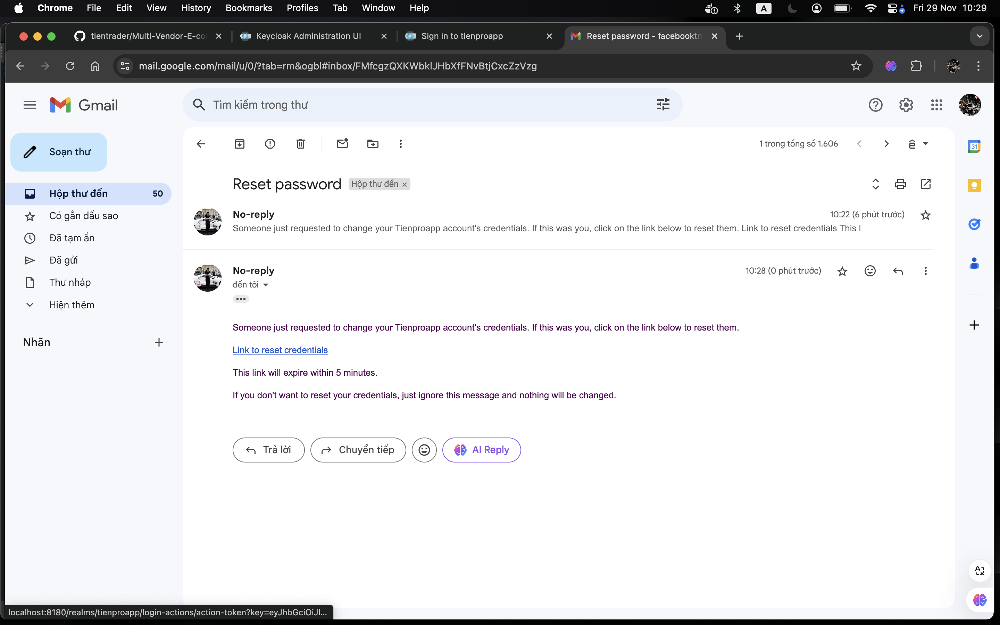
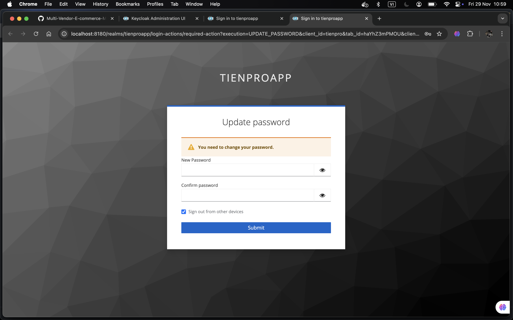

### Databases Management

-  **MySQL:**

  MySQL is used for structured data storage, providing reliable transactional integrity with ACID properties. It handles critical operations such as order processing and financial transactions, ensuring data consistency and reliability. MySQL ensures robust performance under high transaction volumes and guarantees data integrity in critical workflows.

  

-  **MongoDB:**

  MongoDB is employed for storing unstructured or semi-structured data, such as product catalogs, user reviews, and other dynamic content. It offers a flexible and scalable NoSQL solution, enabling efficient querying and indexing of large volumes of diverse data. MongoDB's schema-less design allows for easy scaling and adaptability as business requirements evolve.

  

-  **Redis:**

  Redis is used as an in-memory caching layer to enhance system performance by reducing database load. It accelerates data retrieval by caching frequently accessed data, reducing the number of database queries and speeding up response times by 5–10x. Redis plays a key role in improving user experience and system efficiency by managing high-traffic operations with minimal delay.

  

### Payment Management

-  **Stripe:**

  Stripe offers a comprehensive set of payment processing APIs that support multiple payment methods and currencies. It integrates with webhooks for real-time transaction tracking, allowing for immediate charges upon purchase. Additionally, Stripe facilitates recurring subscriptions, providing a seamless and efficient experience for users.

#### Demo: Card Payment

#### Demo: Stripe Link Payment
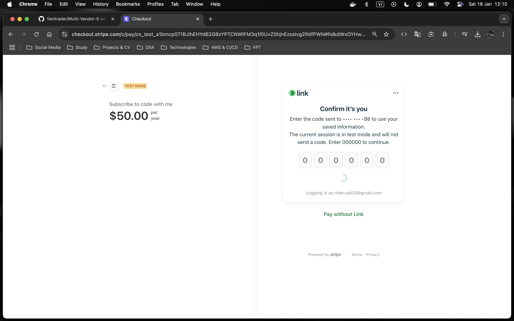
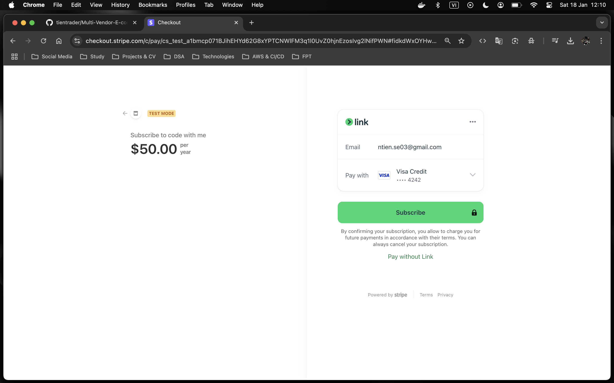
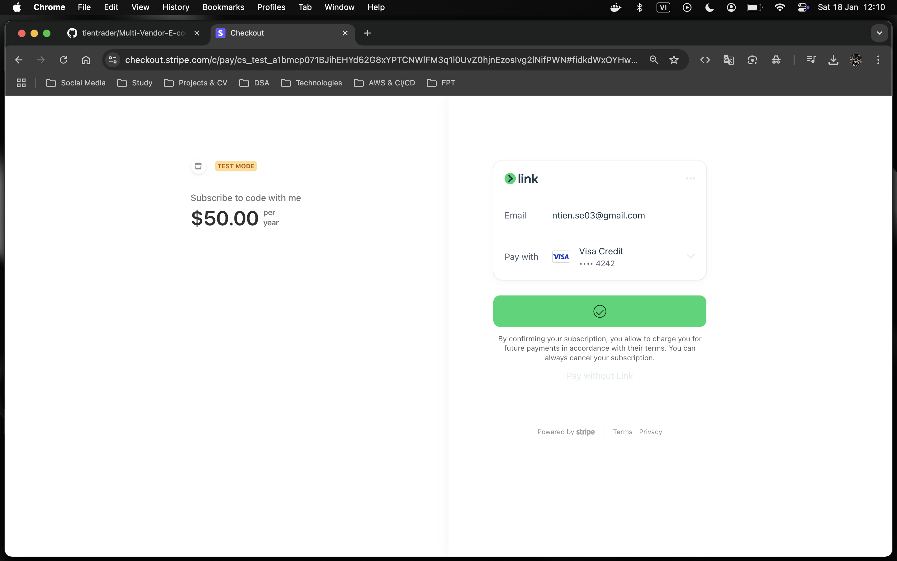

#### Demo: QR Code Payment

#### Payment History (Testing)

### Cloud Services

-  **AWS S3 & AWS Lambda:**

  AWS S3 is used for secure, scalable storage of large volumes of unstructured data (e.g., images, videos), ensuring high availability, durability, and easy accessibility. It supports the platform’s need to store and retrieve media efficiently while minimizing costs.

  To optimize storage and enhance performance, AWS Lambda is integrated to automate image resizing and quality reduction. This process reduces file sizes, optimizes storage, and improves platform efficiency by processing images in real time before they are stored in S3. The seamless integration between AWS S3 and Lambda allows for efficient media processing.

#### Pre-Lambda:
Before Lambda integration, images are uploaded to S3 in their original formats and sizes, without any optimization.

#### Lambda Processing:
Once an image is uploaded, Lambda triggers a resizing and quality reduction process, optimizing the image by reducing its size and maintaining an efficient balance between storage and visual quality.

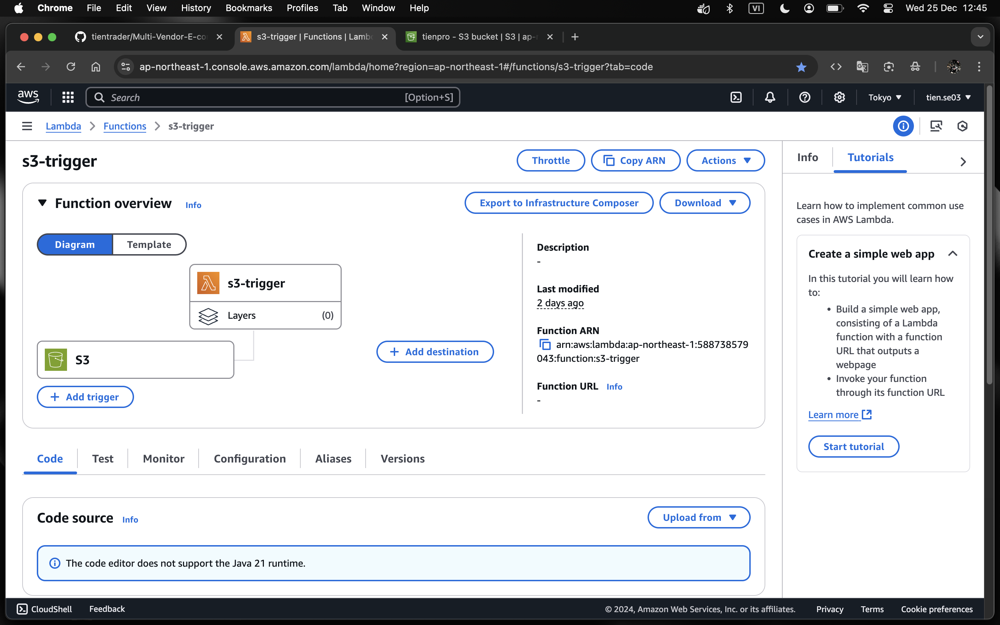

#### Post-Lambda:
The optimized image is stored back in S3, minimizing storage usage while maintaining a balance between performance and quality.

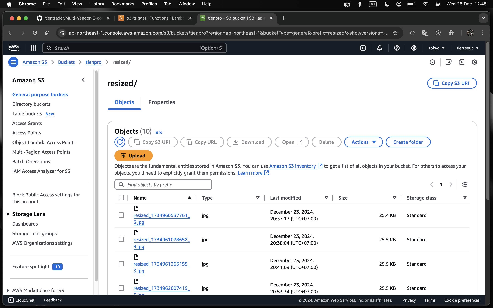

### Resilience

-  **Resilience4j:**

  Resilience4j provides several mechanisms to improve the reliability and stability of microservices:

  - **Circuit Breaker:** Detects failures and prevents requests from reaching unavailable services, maintaining overall system stability.
  - **Retry Mechanism:** Automatically retries failed requests, improving service availability.
  - **Time Limiter:** Ensures requests have a time limit, providing quick failure responses if a service is slow or unresponsive, thus enhancing system performance and responsiveness.

-  **Kafka Dead Letter Queue (DLQ):**  
  Utilizes Kafka's DLQ feature to handle messages that cannot be processed successfully, ensuring that failed messages are captured and can be examined or retried later without affecting the main processing flow.

-  **Kafka Partitioning:**  
  Improves message throughput and scalability by distributing messages across multiple partitions, enabling parallel processing and optimized resource utilization, which enhances system performance and fault tolerance.

### Containerization

-  **Docker:**

  Docker containerizes each service in the microservices architecture, ensuring that each component runs in a consistent environment. This isolation allows for seamless deployment across various environments—development, testing, and production—while maintaining dependency management.

  
  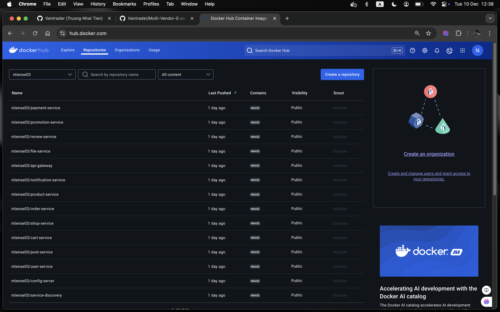

-  **AWS ECR (Elastic Container Registry):**

  AWS ECR securely stores and manages Docker images, providing easy integration with Amazon ECS (Elastic Container Service) and other AWS services to enable efficient container deployment at scale.

  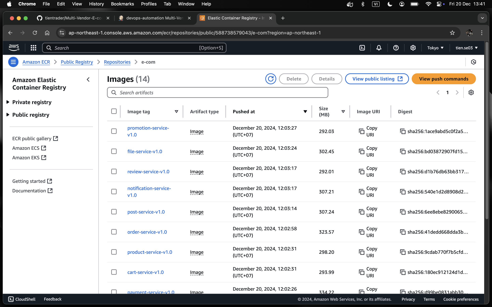

### CI/CD Pipeline Automation

-  **Git:**

  Git is used for version control, enabling collaboration and maintaining code history across multiple developers. It ensures efficient branching, merging, and conflict resolution during development.
  
-  **Jenkins:**

  Jenkins automates the CI/CD pipeline, streamlining the processes of building, testing, and deploying services. It integrates seamlessly with Git repositories to trigger builds on code changes.

**Docker Hub**
  
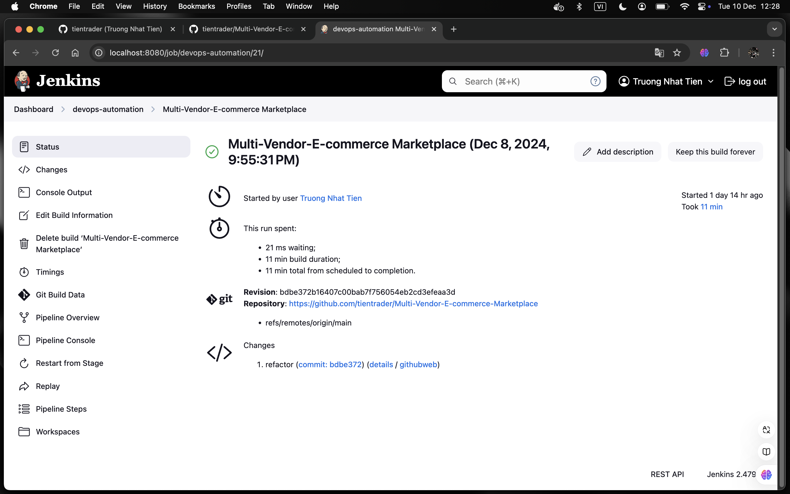

**AWS ECR**
  
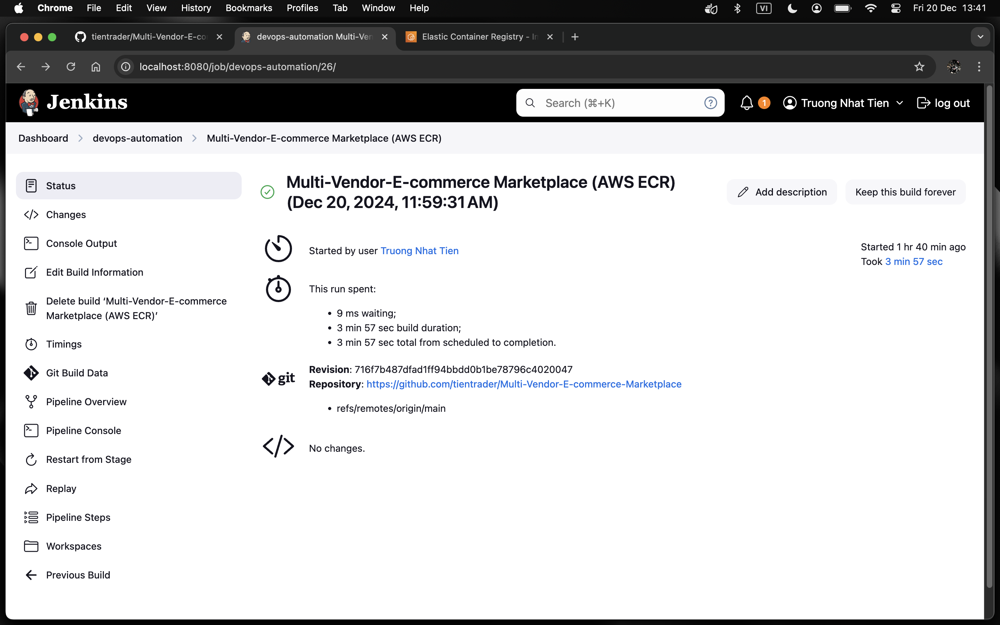
 
### Monitoring and Logging

-  **Prometheus & Grafana:**

  Prometheus is a monitoring system that collects and stores performance metrics from various microservices. These metrics include CPU and memory usage, request latency, error rates, and other system-level metrics. Prometheus uses a time-series database, which allows it to efficiently collect and query large amounts of data.
  

  Grafana is a data visualization tool that integrates with Prometheus to create real-time dashboards. It enables developers and operators to track the health of their systems, monitor performance trends, and quickly identify bottlenecks, failures, or anomalies in the system’s behavior. The combination of Prometheus and Grafana is crucial for observability in microservice architectures.
  
  

-  **Loki:**

  Loki is a log aggregation system designed to collect and store logs from all microservices in a centralized manner. It is optimized for high-volume, low-latency log collection. By integrating Loki with Prometheus, developers can correlate logs with metrics, providing deeper insights into service behavior and system performance. This makes it easier to troubleshoot issues and quickly identify the root cause of problems, especially when the logs are linked to specific performance metrics or error spikes.

  

-  **Zipkin:**

  Zipkin is a distributed tracing system that allows tracking of requests as they flow through different microservices. It helps developers trace performance bottlenecks and latencies across service calls, providing visibility into the end-to-end flow of requests.

  
