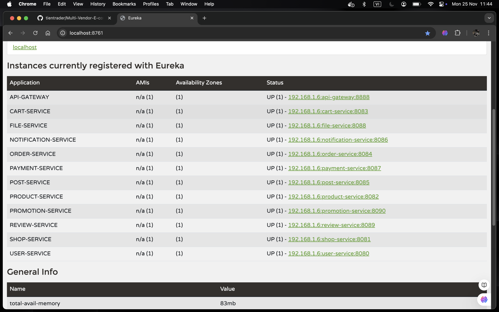
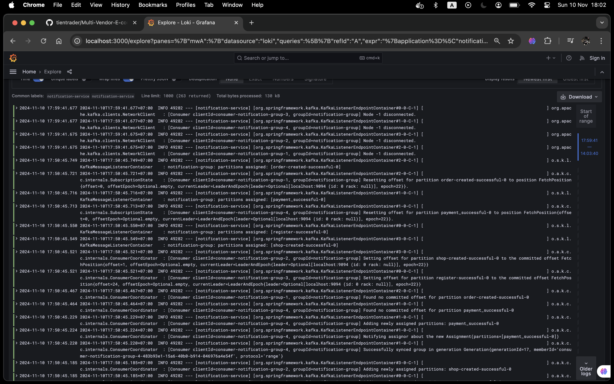

# 🚀 Multi-Vendor E-commerce Marketplace

**Multi-Vendor E-commerce Marketplace** is an advanced two-sided marketplace platform designed to seamlessly bridge buyers and sellers in a dynamic, user-centric ecosystem. The platform enables buyers to explore and purchase an extensive range of products or services from diverse vendors, while empowering sellers to showcase their offerings to a wide audience. Crafted to prioritize exceptional user experience, low-latency interactions, and modern security, **Multi-Vendor E-commerce Marketplace** fosters trust and engagement across all user interactions.

Beyond simply connecting buyers and sellers, **Multi-Vendor E-commerce Marketplace** provides a comprehensive suite of functionalities for seamless order management, payment processing, and multi-channel transaction support. The platform functions as a pivotal enabler for online businesses, promoting growth and revenue generation for all participants in the ecosystem.

## 🏗 Project Architecture

### Microservices Architecture

**Multi-Vendor E-commerce Marketplace** utilizes a microservices architecture to ensure high scalability, fault tolerance, and maintainability. Each service can be independently deployed, scaled, and updated, enabling flexible and resilient performance even under heavy demand.

#### Key Strengths of the Microservices Architecture

- **Service Segmentation and Domain-Driven Design**  
  Each feature is encapsulated within its own microservice, allowing teams to focus on specific domains, improving scalability and productivity. Services evolve independently without cross-service dependencies.

- **Decoupled Service Interactions**  
  Communication between services is achieved via REST APIs and messaging queues, ensuring minimal coupling. This design enables rapid scaling and updates without impacting other services.

- **Fault Tolerance and Resilience**  
  The failure of one service does not affect the others, ensuring continuous availability through mechanisms like circuit breakers and retries. Users experience minimal disruption even when issues arise.

- **Horizontal Scalability**  
  Services can be scaled independently to handle varying loads, ensuring smooth performance during high traffic periods.

- **Simplified Maintenance and CI/CD**  
  Independent service deployment and updates facilitate continuous integration and deployment (CI/CD), accelerating the release of new features and bug fixes with minimal downtime.

- **Centralized Configuration and Service Discovery**  
  Tools like **Spring Cloud Config** and **Eureka Server** enable consistent configuration and automatic service discovery, ensuring high availability.

- **Advanced Observability and Monitoring**  
  Integrated tools like **Prometheus**, **Grafana**, and **Zipkin** provide real-time insights into system performance, enabling proactive issue detection and optimization.

- **Enhanced Security and Access Control**  
  With **Keycloak** and **Spring Security**, the platform ensures secure authentication and access management, protecting sensitive data and transactions with state-of-the-art security protocols.

  

---

## 🛠 Technologies Used

### 1. Java & Spring Framework

- **Java:**
  Java is the primary language for building microservices, leveraging its multithreading capabilities and high performance. It provides a robust environment for scalable and maintainable solutions, particularly for services handling high transaction volumes like payments and orders.

- **Spring Framework:**
  - **Spring Boot:** Enables rapid microservice development with minimal configuration, significantly reducing boilerplate code.
  - **Spring WebFlux:** Facilitates the creation of asynchronous APIs through reactive programming, ensuring system responsiveness under high loads.
  - **Spring Security:** Manages security across microservices, offering authentication and authorization features. Key integrations include Single Sign-On (SSO) and JSON Web Token (JWT) authentication.
  - **Spring Data JPA:** Streamlines database interactions through repositories, simplifying data retrieval and CRUD operations.
  - **Spring Cloud:** Provides essential tools for managing and routing microservices, enhancing scalability and flexibility in API development.
 
### 2. Service Communication

- **OpenFeign:**
  OpenFeign simplifies inter-microservice communication by automatically creating REST client proxies, reducing boilerplate code and enhancing developer productivity.

- **Kafka:**
  Kafka facilitates asynchronous communication between services, ensuring safe storage and distribution of messages.
 
### 3. Config Server & Service Discovery

- **Spring Cloud Config:**  
  Provides server and client-side support for externalized configuration in a distributed system. This enables centralized management of configuration properties across all microservices, making updates easier and ensuring configuration consistency.

- **Eureka Server:**  
  Acts as a service registry, allowing microservices to discover each other. This simplifies the management of service instances and endpoints, enabling dynamic scaling and fault tolerance by ensuring that service instances are registered and available for seamless communication.

  

### 4. Databases

- **MySQL:**
  MySQL ensures data consistency through ACID properties, allowing critical transactions to be processed accurately. It is configured with replication and sharding to handle high query volumes without performance degradation.

- **MongoDB:**
  MongoDB is employed for unstructured data storage, such as product information and user reviews, providing a flexible and scalable NoSQL solution.

- **Redis:**
  Redis acts as a caching solution to alleviate load on MySQL and MongoDB, accelerating data access and reducing the number of database queries.

- **AWS S3:**
  AWS S3 is utilized for storing large volumes of unstructured data (e.g., images and videos), providing a highly durable and scalable storage solution.

  

### 5. Identity and Access Management

- **Keycloak:**
  - **Single Sign-On (SSO):** Users can log in once to access multiple services, with support for OAuth 2.0 and OpenID Connect, providing seamless authentication across the platform.
  - **Social Login:** Allows users to log in via their social accounts (e.g., Google, Facebook), simplifying the authentication process and improving user experience.
  - **User Management:** Streamlines user registration, email verification, password recovery, and overall account management, ensuring a smooth user experience.
  - **Role-Based Access Control (RBAC):** Ensures that only authorized users can access specific features and resources, enhancing security and protecting sensitive operations.
  - **Email Verification:** Verifies users' email addresses during registration to ensure account authenticity and prevent fraudulent sign-ups.
  - **Logout:** Provides secure logout functionality by invalidating sessions and tokens, protecting against unauthorized access.

- **JWT (JSON Web Tokens):**
  JWT secures API communications with authentication tokens, mitigating CSRF attacks and enhancing data security.

  

### 6. Payment Management

- **Stripe:**
  Stripe provides comprehensive payment processing APIs that support various payment methods and currencies. Its webhook integration enables real-time transaction tracking. This allows for instant **charges** upon purchase and facilitates **recurring subscriptions** for users, enhancing overall transaction efficiency and user experience.

  

### 7. Monitoring and Logging

- **Prometheus & Grafana:**
  These tools collect performance metrics for analysis and visualization, enabling real-time monitoring of system health.

  
  
  

- **Loki:**
  Loki serves as a centralized logging system, aggregating logs from microservices for efficient diagnosis and resolution of issues.

  

### 8. Distributed Tracing

- **Zipkin:**
  Zipkin allows for tracking the flow of requests through the system, helping to identify bottlenecks and optimize performance.

  

### 9. Docker for Containerization

- **Docker:**  
  Docker is used to containerize each service in the microservices architecture, ensuring that each component can be deployed with its dependencies in isolated environments. This enables consistent behavior across different environments, including development, testing, and production.

- **Docker Compose:**  
  Docker Compose is utilized to orchestrate multi-container setups, allowing services such as MySQL, MongoDB, Redis, Grafana, Kafka, and Prometheus to be managed together efficiently. This simplifies starting, stopping, and scaling services in local and cloud environments.

  
  
### 10. Resilience

- **Resilience4j:**
  - **Circuit Breaker:** Prevents requests to unavailable services, maintaining system stability.
  - **Retry Mechanism:** Automatically retries failed requests, enhancing reliability.
  - **Time Limiter:** Sets a maximum allowable time for requests, ensuring quick failure responses if a service is slow or unresponsive, thereby enhancing overall system responsiveness.
  
---

## 💡 Key Contributions

- **Identity & Access Control:** Integrated **Keycloak** with **Spring Security** to enable Single Sign-On (**SSO**), social login, email verification, and password recovery/reset, providing a seamless user experience. Secured passwords with the **Argon2** hashing algorithm and implemented **RBAC** with **JWT** for access management. Enhanced account security using **OAuth 2.0** and **OpenID Connect**, ensuring secure login, logout, and user session management.

- **Asynchronous Processing & Data Efficiency:** Achieved a 95% reduction in response times through asynchronous processing with **Kafka** and **CompletableFuture**, simplifying service communication with **OpenFeign**. Enhanced data transfer efficiency by 90% with **Gzip** compression, reducing payload sizes.

- **API Gateway & Service Reliability:** Enhanced API Gateway performance with non-blocking JWT decoding using **Spring Cloud Gateway** and **Reactor**. Established centralized configuration management with **Config Server**, integrated **Eureka** for real-time service discovery, and implemented load balancing to handle traffic spikes, ensuring high availability and reliable performance.

- **Data Management & Optimization:** Integrated **AWS S3** for secure, scalable, and cost-effective media file storage with high availability and durability. Used **Redis** for caching to boost data access speeds, reducing database load by 70% for frequently accessed data. Employed **MongoDB** for unstructured data storage and **MySQL** for ACID compliance in critical transactions.

- **Resilience & Real-Time Monitoring:** Achieved 99.9% uptime by implementing **Resilience4j** with circuit breakers, retries, fallbacks, and timeouts. Enabled **real-time monitoring** with **Prometheus** and **Grafana**, improving issue detection. Streamlined troubleshooting with centralized logging via **Loki** and request tracing using **Zipkin**, reducing root-cause analysis time.

- **Payment Integration & Automation:** Reduced manual intervention by 90% by implementing **Stripe** for handling one-time and recurring subscription payments with instant charge capabilities. Utilized webhooks for real-time transaction updates, ensuring accurate, automated payment statuses and providing a seamless user experience.

---

## 🏁 Conclusion

**Multi-Vendor E-commerce Marketplace** exemplifies cutting-edge software architecture, combining scalability, reliability, and high security to meet the evolving demands of a modern digital marketplace. Through a microservices-driven approach, the platform not only delivers seamless interactions and rapid responsiveness but also positions itself for future growth and innovation. This architecture underlines a commitment to delivering best-in-class solutions, enhancing user experiences, and facilitating robust, secure e-commerce operations in a rapidly expanding online marketplace. 
