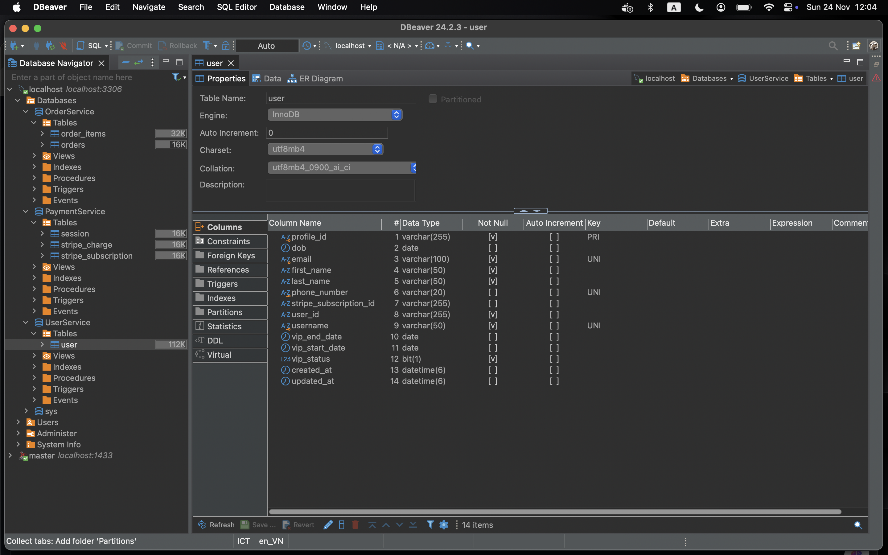
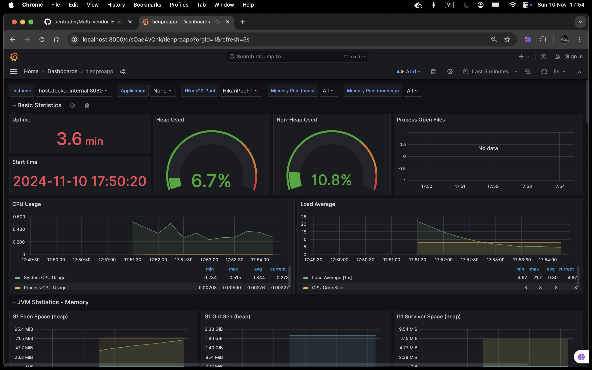
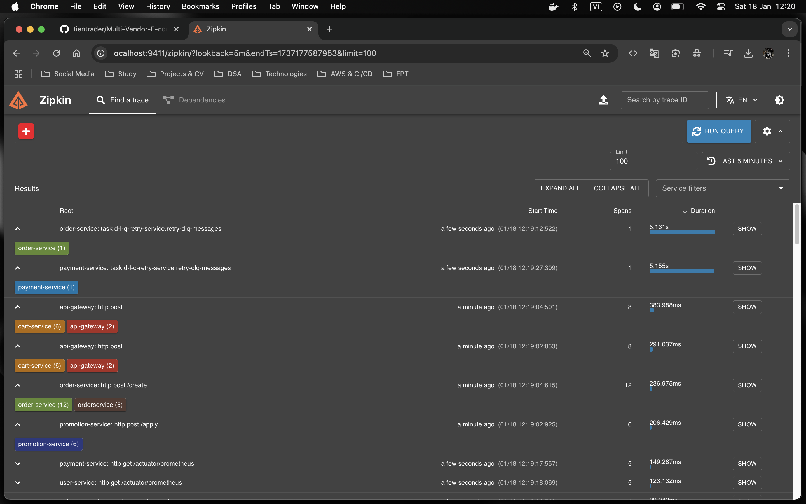

# 📌 Multi-Vendor E-commerce Marketplace

**Multi-Vendor E-commerce Marketplace** is a robust platform connecting buyers and sellers in a seamless, user-centric ecosystem. It offers features for easy product discovery, order management, secure payment processing, and multi-channel transaction support. Designed for exceptional user experience and scalability, it ensures secure and reliable interactions for all participants.

❗️ The system is designed to handle and process nearly all business scenarios, adhering to best practices for data integrity and security, ensuring that the platform remains reliable and protected against potential issues.

## 🏗 Architecture Overview

### Microservices Architecture

The platform uses microservices for scalability, resilience, and independent service updates.

#### Highlights:

- **Service Segmentation**:  
  Each feature is encapsulated within its own service, allowing teams to focus on specific domains. This modular approach improves scalability, productivity, and the ability to update or replace individual services without affecting the entire system.  

- **Decoupled Communication**:  
  Services interact through REST APIs and messaging queues, ensuring loose coupling between components. This flexibility allows each service to operate independently, enabling seamless updates and reducing the risk of cascading failures.  

- **Fault Tolerance**:  
  Mechanisms like circuit breakers, retries, and fallback strategies ensure that service failures are isolated. Users experience minimal disruption, as the system remains operational even if one or more services encounter issues.  

- **Scalability**:  
  Each service can be independently scaled based on demand. For example, if the Order Service experiences high traffic, only that service is scaled, optimizing resource usage and maintaining performance during peak loads.  

- **Cost Optimization**:  
  The independent scalability of services helps allocate resources efficiently. You can expand only the services under heavy demand without increasing the infrastructure costs for the entire system, making the architecture both efficient and cost-effective.  

- **Easy Maintenance**:  
  Continuous Integration and Continuous Deployment (CI/CD) pipelines enable rapid development, testing, and deployment of new features. This reduces downtime during updates and accelerates the release cycle.  

- **Centralized Management**:  
  Tools like **Spring Cloud Config** manage system-wide configuration, while **Eureka Server** provides automatic service registration and discovery. These tools ensure high availability and simplify system management.  

- **Observability**:  
  Monitoring and logging tools like **Prometheus**, **Grafana**, and **Zipkin** provide deep insights into the system's health and performance. These real-time analytics help proactively detect and resolve issues, ensuring the system remains reliable.  

  

---

## 🛠 Technologies Used

### Java & Spring Framework

-  **Java:**

  Java is the primary language for building microservices, leveraging its multithreading capabilities and high performance. It provides a robust environment for scalable and maintainable solutions, particularly for services handling high transaction volumes like payments and orders.

-  **Spring Framework:**

  - **Spring Boot:** Enables rapid microservice development with minimal configuration, significantly reducing boilerplate code.
  - **Spring WebFlux:** Facilitates the creation of asynchronous APIs through reactive programming, ensuring system responsiveness under high loads.
  - **Spring Security:** Manages security across microservices, offering authentication and authorization features. Key integrations include Single Sign-On (SSO) and JSON Web Token (JWT) authentication.
  - **Spring Data JPA:** Streamlines database interactions through repositories, simplifying data retrieval and CRUD operations.
  - **Spring Cloud:** Provides essential tools for managing and routing microservices, enhancing scalability and flexibility in API development.

### Identity and Access Management

-  **Keycloak:**

  - **Single Sign-On (SSO):** Users can log in once to access multiple services, with support for OAuth 2.0 and OpenID Connect, providing seamless authentication across the platform.
  - **User Management:** Streamlines the processes of user registration, login, logout, email verification, password recovery, and overall account management, ensuring a seamless user experience.
  - **Email Verification:** Verifies users' email addresses during registration to ensure account authenticity and prevent fraudulent sign-ups.
  - **Argon2 Password Hashing:** Utilizes the Argon2 hashing algorithm for password storage, providing robust security against brute-force attacks and improving the overall resilience of user account security.
  - **Role-Based Access Control (RBAC):** Ensures that only authorized users can access specific features and resources, enhancing security and protecting sensitive operations.
  - **JSON Web Tokens (JWT):** JWT secures API communications with authentication tokens, mitigating CSRF attacks and enhancing data security.
  - **Social Login:** Allows users to log in via their social accounts (e.g., Google, Facebook, Github), simplifying the authentication process and improving user experience.
 
#### Demo: Registration

#### Demo: Login (Username & Password)

#### Demo: Forgot Password

### Databases Management

-  **MySQL:**

  MySQL ensures data consistency through ACID properties, allowing critical transactions to be processed accurately.  

  

-  **MongoDB:**

  MongoDB is employed for unstructured data storage, such as product information and user reviews, providing a flexible and scalable NoSQL solution.  

  

-  **Redis:**

  Redis acts as a caching solution to alleviate load on MySQL and MongoDB, accelerating data access and reducing the number of database queries.  

  

-  **AWS S3:**

  AWS S3 is utilized for storing large volumes of unstructured data (e.g., images and videos), providing a highly durable and scalable storage solution.  

  
  
### Payment Management

-  **Stripe:**

  Stripe provides comprehensive payment processing APIs that support various payment methods and currencies. Its webhook integration enables real-time transaction tracking. This allows for instant **charges** upon purchase and facilitates **recurring subscriptions** for users, enhancing overall transaction efficiency and user experience.

  
  
  
 
### Config Server & Service Discovery

- **Spring Cloud Config:**
  Provides server and client-side support for externalized configuration in a distributed system. This enables centralized management of configuration properties across all microservices, making updates easier and ensuring configuration consistency.

- **Eureka Server:**
  Acts as a service registry, allowing microservices to discover each other. This simplifies the management of service instances and endpoints, enabling dynamic scaling and fault tolerance by ensuring that service instances are registered and available for seamless communication.

  

### Monitoring and Logging

-  **Prometheus & Grafana:**

  These tools collect performance metrics for analysis and visualization, enabling real-time monitoring of system health.

  
  
  

-  **Loki:**

  Loki serves as a centralized logging system, aggregating logs from microservices for efficient diagnosis and resolution of issues.
  
  

### Distributed Tracing

-  **Zipkin:**

  Zipkin allows for tracking the flow of requests through the system, helping to identify bottlenecks and optimize performance.

  

### Containerization

-  **Docker:**

  Docker is used to containerize each service in the microservices architecture, ensuring that each component can be deployed with its dependencies in isolated environments. This enables consistent behavior across different environments, including development, testing, and production.

- **Docker Compose:**
  Docker Compose is utilized to orchestrate multi-container setups, allowing services such as MySQL, MongoDB, Redis, Grafana, Kafka, and Prometheus to be managed together efficiently. This simplifies starting, stopping, and scaling services in local and cloud environments.

  

### Service Communication

-  **Kafka:**

  Kafka facilitates asynchronous communication between services, ensuring safe storage and distribution of messages. It allows services to communicate efficiently in an event-driven architecture, decoupling services and improving scalability.
  
- **OpenFeign:**

  OpenFeign simplifies inter-microservice communication by automatically creating REST client proxies, reducing boilerplate code and enhancing developer productivity.
  
### Resilience

-  **Resilience4j:**

  - **Circuit Breaker:** Prevents requests to unavailable services, maintaining system stability.
  - **Retry Mechanism:** Automatically retries failed requests, enhancing reliability.
  - **Time Limiter:** Sets a maximum allowable time for requests, ensuring quick failure responses if a service is slow or unresponsive, thereby enhancing overall system responsiveness.
